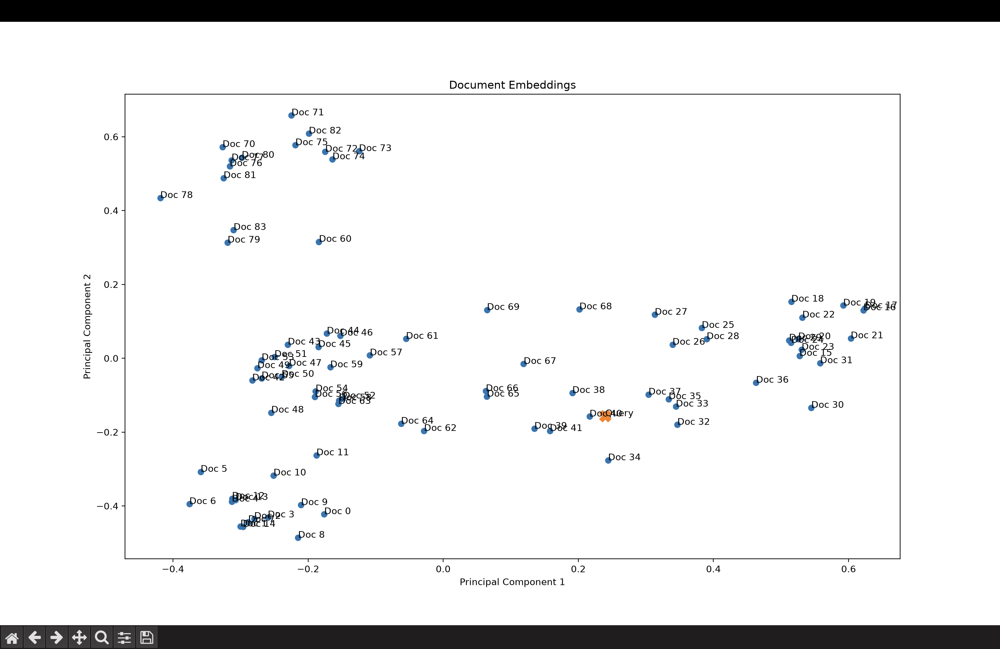

# bi-encoder

A small bi-encoder semantic search pipeline built from scratch. Documents and queries are embedded independently into the same vector space, then ranked by cosine similarity. The similarity math is implemented by hand with NumPy, not taken from a library.

## How it works

```
documents ──► encoder ──► document vectors ─┐
                                            ├─► cosine similarity ──► top-k results
query     ──► encoder ──► query vector ─────┘
```

1. **Load**: `data/documents.txt` is split on blank lines into separate documents (84 technical passages on Kafka, AWS, Kubernetes, Java, databases and more).
2. **Embed**: each document is encoded once with `all-MiniLM-L6-v2` (a 384-dimensional sentence-transformers model).
3. **Retrieve**: the query is encoded with the same model and compared against every document vector using cosine similarity. The top-k matches are returned.
4. **Visualize**: embeddings are projected to 2D with PCA so you can see where the query lands among the documents.
5. **Generate (optional)**: retrieved documents can be formatted into a RAG prompt and sent to an LLM. This step is commented out in `main.py`.

Cosine similarity is computed from first principles in [src/similarity.py](src/similarity.py):

```
cos(a, b) = (a · b) / (‖a‖ · ‖b‖)
```

## Project structure

```
.
├── main.py              # Entry point: embed, retrieve, print results, plot
├── data/documents.txt   # Corpus, one document per paragraph
└── src/
    ├── embedding.py     # Model loading, document loading, embedding
    ├── similarity.py    # Dot product, vector norm, cosine similarity
    ├── retrieval.py     # Score every document and return the top-k
    ├── visualizer.py    # PCA projection and scatter plot
    ├── llm.py           # Settings, context formatting, ChatOpenAI client
    └── prompt.py        # RAG prompt template
```

## Getting started

```bash
python -m venv .venv
source .venv/bin/activate
pip install -r requirements.txt
```

`main.py` builds the LLM client at startup, so it expects a `.env` file with an API key even though the generation step is currently disabled:

```env
LLM_API_KEY=your-key-here
```

Optional overrides: `LLM_MODEL`, `LLM_TIMEOUT_SECONDS`, `LLM_MAX_RETRIES`.

Then run:

```bash
python main.py
```

The first run downloads the embedding model. The script prints the top 5 matches for the query defined in `main.py`, then opens a matplotlib window with the embedding plot.

## Example

Query:

> How does Kubernetes maintain the user defined number of application instances while allowing changes to be introduced without replacing everything at once?

The plot below shows all 84 document embeddings reduced to two dimensions with PCA. The orange **X** is the query. Documents on the same topic cluster together, and the query lands inside the Kubernetes cluster, which is what you'd expect from a working encoder.



PCA keeps only two of the 384 dimensions, so distances in the plot are an approximation. Use the cosine scores in the terminal output as the ground truth for ranking.

## Using your own data

Edit `DOCUMENT_PATH` and `QUERY` in [main.py](main.py). Put one document per paragraph in the text file, with a blank line between documents.

## Enabling the LLM answer step

Uncomment the block in `main.py` that calls `format_context`, `prompt.invoke` and `llm_model.invoke`. The prompt in [src/prompt.py](src/prompt.py) instructs the model to answer only from the retrieved context.

## Tech stack

- [sentence-transformers](https://www.sbert.net/) for embeddings
- NumPy for the similarity math
- scikit-learn and matplotlib for PCA and plotting
- LangChain and pydantic-settings for the optional LLM step
